<h1 align="center"> 
   
</h1>

<p align="center"> 
   
  <br> 
  <b>Computer Science Student @ UFCA • Brazil</b> <br> 
  <i>"Porque o salário do pecado é a morte, mas o dom gratuito de Deus é a vida eterna em Cristo Jesus, nosso Senhor."</i> <br> <b>Romanos 6:23</b> 
</p>

<p align="center"> 
   
</p>

---


<br>

## 💫 About Me

```javascript
const luma = {
  role: "Computer Science Student",
  location: "Brazil 🇧🇷",
  passions: [
    "Game Development 🎮",
    "Web Development 🌐",
    "UI/UX Design 🎨",
    "Creative Coding 🧩",
    "Software Dev ⚙️"
  ],
  currentFocus: "Turning ideas into interactive experiences",
  funFact: "I debug with music and tears 🎵😭"
};
```

---

## 🌸 Passions & Vibes

> 📚 Reading · 🎤 Singing · 🌎 Languages · 🎬 K-dramas · 🎮 Gaming · 🎨 Drawing · 💻 Coding

---

## 🚀 Tech Stack

### 🧩 Languages


### 🌐 Front-End


### 🎨 Design Tools


### 🛠 Tools & Environment


---

## 📊 GitHub Analytics

<div align="center">
  
</div>

---

## ✨ Motto

> _"Code with logic. Create with passion."_

---

<p align="center">
   <br>
  <b>Thanks for stopping by! 🌸</b>
</p>

---

<p align="center">
  <a href="https://www.linkedin.com/in/luma-oliveira-271ab73a7/">
    
  </a>
  <a href="mailto:lumaluiza1992@gmail.com">
    
  </a>
  <a href="#">
    
  </a>
</p>
